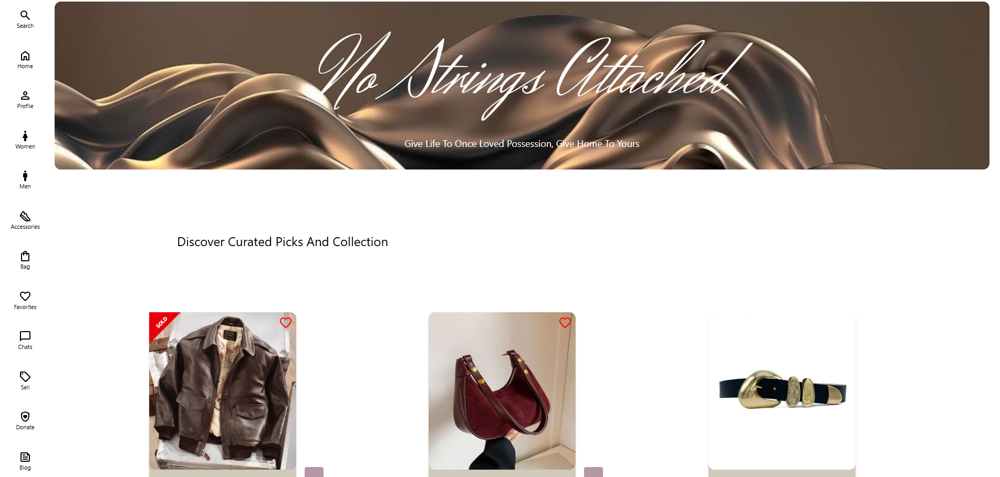
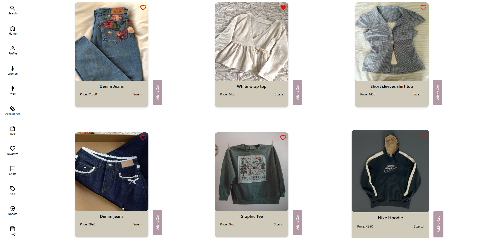
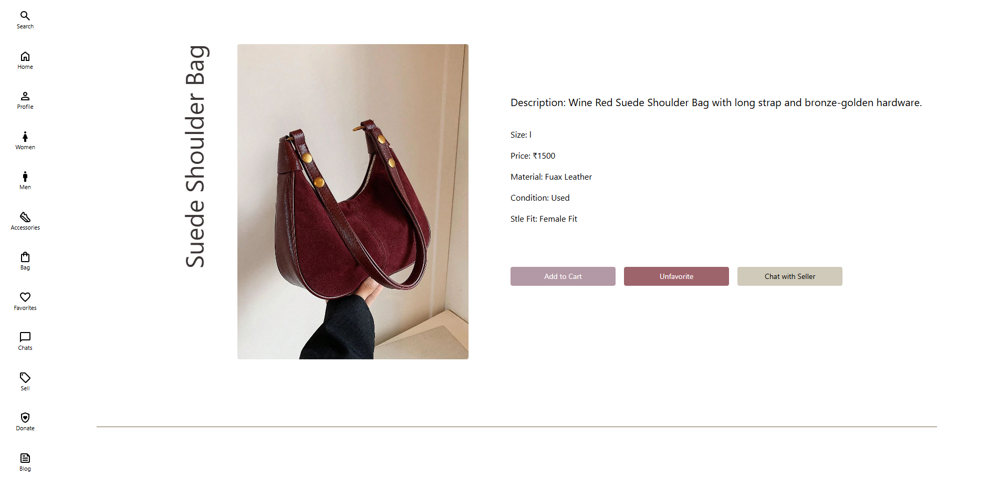
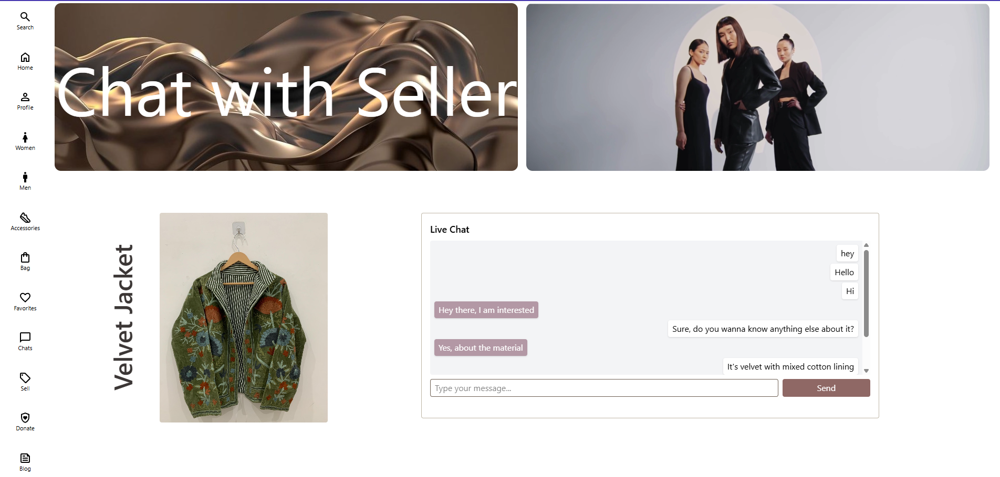
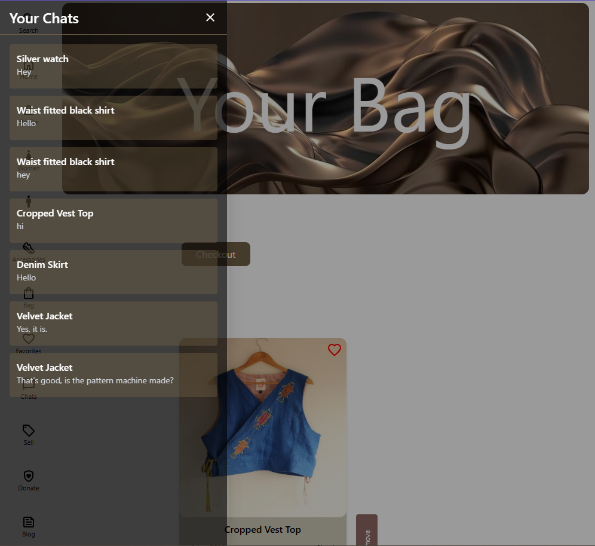
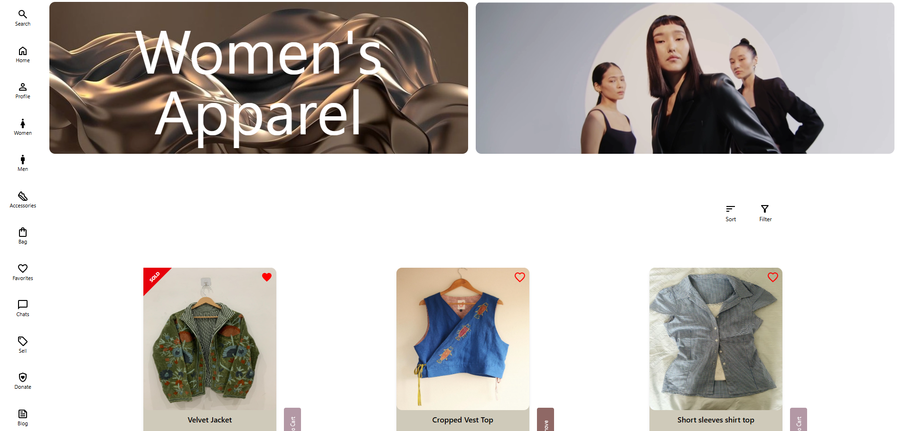
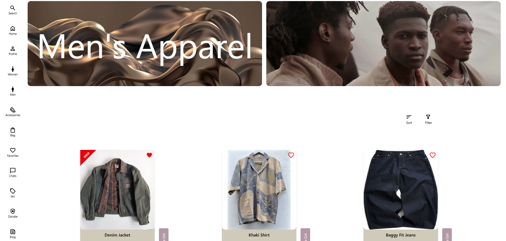
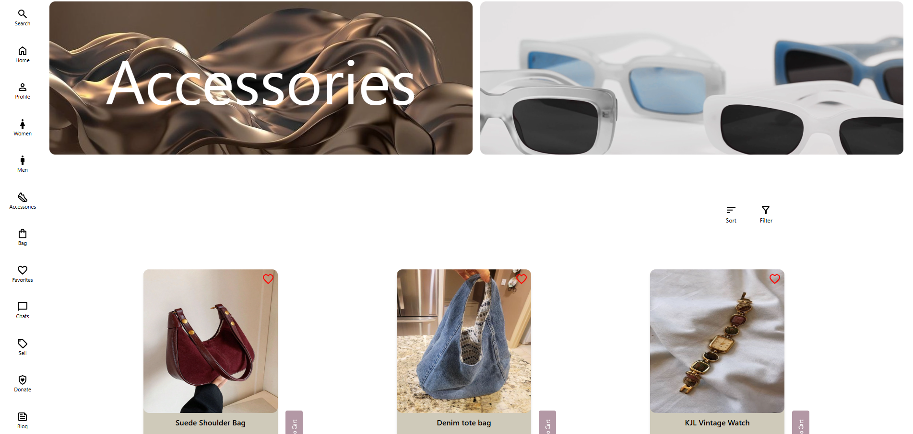
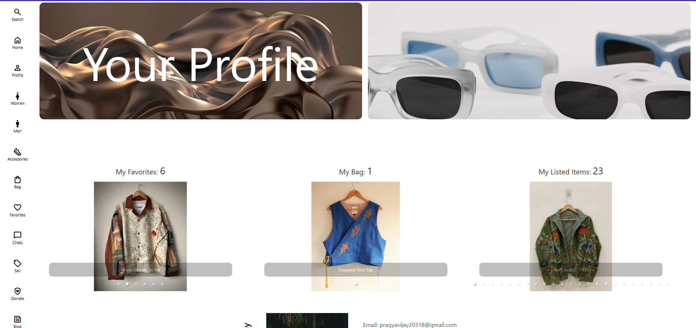
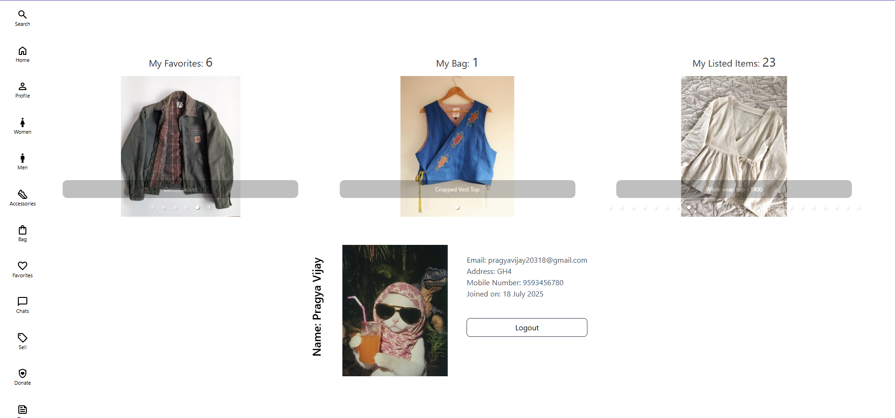

# No Strings Attached - Frontend

**No Strings Attached** is a sustainable thrifting platform enabling users to buy, sell, donate, and interact over secondhand fashion. This is the **frontend repository** of the project, built using **ReactJS**.

## 🌐 Tech Stack

- **React.js** (Vite)
- **Tailwind CSS** for styling
- **Framer Motion** for animations
- **React Router** for routing
- **Socket.io-client** for real-time chat

---

## 📁 Project Structure

```
Frontend/
├── public/
│   ├── Background/
│   └── NavigationIcons/
├── src/
│   ├── components/
│   │   ├── accessories/
│   │   │   ├── Accessories.jsx
│   │   │   └── HeaderAccessories.jsx
│   │   ├── bag/
│   │   │   ├── Bag.jsx
│   │   │   └── HeaderBag.jsx
│   │   ├── blog/
│   │   │   ├── Blog.jsx
│   │   │   ├── BlogCard.jsx
│   │   │   ├── ContentsBlog.jsx
│   │   │   └── HeaderBlog.jsx
│   │   ├── chat/
│   │   │   ├── Chat.jsx
│   │   │   ├── ChatList.jsx
│   │   │   ├── ChatPage.jsx
│   │   │   └── HeaderChat.jsx
│   │   ├── checkout/
│   │   │   ├── Checkout.jsx
│   │   │   ├── CheckoutConfirmation.jsx
│   │   │   ├── CheckoutPayment.jsx
│   │   │   └── CheckoutSummary.jsx
│   │   ├── Common/
│   │   │   ├── Contents.jsx
│   │   │   ├── Filter.jsx
│   │   │   ├── Footer.jsx
│   │   │   ├── HeaderProducts.jsx
│   │   │   ├── NavigationBar.jsx
│   │   │   ├── Products.jsx
│   │   │   ├── ProductCard.jsx
│   │   │   └── ProtectedRoute.jsx
│   │   ├── donate/
│   │   │   └── Donate.jsx
│   │   ├── favorites/
│   │   │   ├── favorites.jsx
│   │   │   └── HeaderFavorite.jsx
│   │   ├── home/
│   │   │   ├── HeaderHome.jsx
│   │   │   └── HomePage.jsx
│   │   ├── login/
│   │   │   └── Login.jsx
│   │   ├── men/
│   │   │   ├── HeaderMen.jsx
│   │   │   └── Men.jsx
│   │   ├── profile/
│   │   │   ├── HeaderProfile.jsx
│   │   │   ├── Profile.jsx
│   │   │   └── profile.css
│   │   ├── sell/
│   │   │   ├── ContentSell.jsx
│   │   │   ├── HeaderSell.jsx
│   │   │   ├── Heading.jsx
│   │   │   └── Sell.jsx
│   │   ├── signup/
│   │   │   └── Signup.jsx
│   │   └── women/
│   │       ├── HeaderWomen.jsx
│   │       └── Women.jsx
│   ├── utils/
│   │   └── auth.js
│   ├── App.css
│   ├── App.jsx
│   ├── index.css
│   └── main.jsx
├── .env
```

---

## 📦 Features

- 🛍️ Product Listing & Browsing (Clothing & Accessories)
- 👤 Profile with Carousel for Bag, Favorites, and Listings
- 💬 Real-time chat with sellers
- 🧾 Checkout with UPI QR and order confirmation
- ❤️ Favorite products
- 📦 View and manage items in bag
- 🔐 Login / Signup with protected routes
- 🎁 Option to donate clothes

---

## 🔧 Environment Variables

Create a `.env` file in the root and include:

```
VITE_BACKEND_URL=http://localhost:8080
VITE_SOCKET_URL=http://localhost:8080

```

---

## 🚧 Future Development

- Razorpay Integration for real-time UPI verification
- Accessibility & UX improvements
- Dark mode support

---

## 🖼️ Screenshots (Add below)

### Home Page


### Products Listing


### Product


### Chat


### Chat List


### Women 


### Men


### Accessories


### Profile


### Profile Info


---


© 2025 No Strings Attached — All rights reserved.
